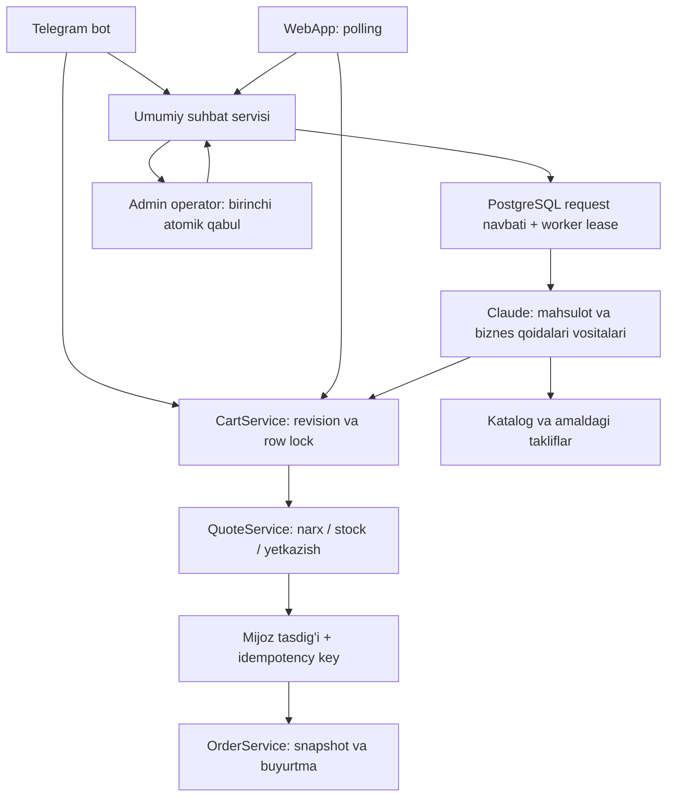
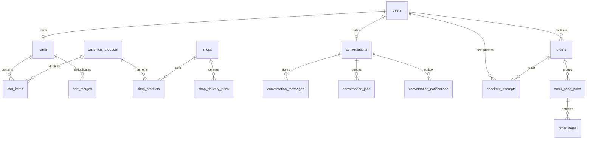

# QurBot: bitta sotuvchi, ikki kanal

QurBot mijoz bilan o'z katalogi orasidagi AI savdo yordamchisi. Tashqi do'kon
marketplace'i emas. Eski `shops` va buyurtma qismlari jadvali saqlanadi; amaldagi
takliflar QurBot'ning ichki sotuvchi yozuviga bog'lanadi.

## DB bog'lanishlari

- Savat: foydalanuvchiga bitta yozuv, monoton `revision`; tarixiy `baskets`
  tugallangan buyurtmalar uchun qoladi. Guest/legacy import receipt qayta
  ko'chirishdan saqlaydi. Narx savatda saqlanmaydi.
- Suhbat: bir foydalanuvchiga bitta; `ai → waiting → human → ai`.
  `operator_id`, `generation` va worker lease eski AI javobi/operatorga o'tish
  poygasini boshqaradi. Job ichida tool natijalari va manbalari saqlanadi.
- Import: checksum, Excel sheet/qator va variant belgisi canonical attributes
  ichida audit sifatida saqlanadi. Noaniq narx `price_on_request`; tekshirilmagan
  stock `stock_unverified`. Soxta nol narxli savdo taklifi yaratilmaydi.
- Buyurtma: foydalanuvchi+idempotency kaliti takrorni bir natijaga bog'laydi;
  `is_test` yozuvlar fulfillment, mukofot va odatiy savdo metrikalaridan chiqariladi.

## AI va bilim

Bu release'da vektor DB yoki embedding yo'q. AI katalog qidiruvi, amaldagi
takliflar va tasdiqlangan yetkazish/yordam qoidalarini backend vositalari orqali
oladi. Narx va mavjudlikni model emas, backend hisoblaydi. Manba bo'lmasa
aniqlashtirish yoki operator kerak. Yakuniy buyurtmani AI tasdiqlamaydi.

## Operatsion chegaralar

Redis bot FSM va worker transporti uchun; asosiy savat/suhbat/request holati
PostgreSQL'da. Worker cron qolib ketgan requestlarni qayta oladi. Telegram
sendMessage idempotent emas: outbox muvaffaqiyatli yuborilganlarni takrorlamaydi,
lekin Telegram qabul qilganidan keyingi jarayon halokatida xabar takrorlanishi
mumkin; buyurtma/idempotent backend amali bundan alohida himoyalangan.

Frontend chat javoblarini HTML emas, text node qilib chiqaradi. Yozish endpointlari
signed session, egalik tekshiruvi va sessionga bog'langan CSRF token ishlatadi.
Test/release dalillari va buyruqlar: [SALES_RELEASE.md](SALES_RELEASE.md).
